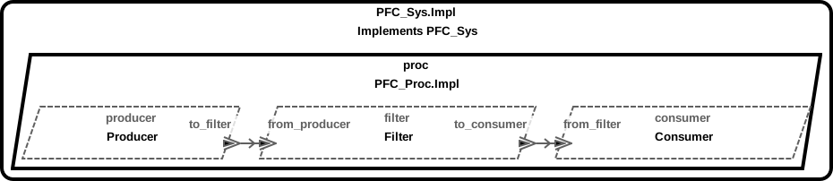

# Periodic Producer-Filter-Consumer Using Wire Protocol



## Required AADL Model Property Annotations

- `HAMR::Bit_Codec_Raw_Connections => true` must be added to the top level system (e.g. [PFC_Sys.Impl](PFC.aadl#L39))

- The encoded size for each data type used in connections between threads must be 
  specified using the `HAMR::Bit_Codec_Max_Size` property.  For example, 
  [Mission](PFC.aadl#L15-L23)
  is used in connections [c1](PFC.aadl#L51) and [c2](PFC.aadl#L52) so its defintion
  must specify the [Bit_Codec_Max_Size](PFC.aadl#L22).  
  
  This property
  only needs to be attached to the top level data component (e.g. array subtypes
  and record field types do not need to be modified if they are not directly
  used in a connection)
  
  Wrapper data components would currently (2020.05.09) need to be introduced to handle connections using 
  AADL 
  [Base_Types](https://github.com/osate/osate2/blob/master/core/org.osate.contribution.sei/resources/packages/Base_Types.aadl)
  so that the property can be attached.
  
## Behavior code provided via C
  
  Behavior code and supporting APIs are located in the following directories
  
  [slang_embedded_excludes/src/c/ext-c/Producer_Impl](slang_embedded_excludes/src/c/ext-c/Producer_Impl)

  [slang_embedded_excludes/src/c/ext-c/Filter_Impl](slang_embedded_excludes/src/c/ext-c/Filter_Impl)

  [slang_embedded_excludes/src/c/ext-c/Consumer_Impl](slang_embedded_excludes/src/c/ext-c/Consumer_Impl)
  
### Running example under Linux
  
  ```
  periodic/slang_embedded_excludes/bin/transpile.sh
  periodic/slang_embedded_excludes/bin/compile-linux.sh 
  periodic/slang_embedded_excludes/bin/run-linux.sh 
  periodic/slang_embedded_excludes/bin/stop.sh 
  ```
  
  Output should be similar to what is seen when running under [QEMU](#running-exmaple-under-sel4qemu)
  
### Running example under seL4/QEMU
  
  ```
  periodic/slang_embedded_excludes/bin/transpile-sel4.sh
  rm -rf ~/CASE/camkes/projects/camkes/apps/CAmkES_seL4
  periodic/slang_embedded_excludes/src/c/CAmkES_seL4/bin/run-camkes.sh
  ```
  
  Output should resemble
  
  ```
...
PFC_Sys_Impl_Instance_proc_consumer: Received [FF000000]
PFC_Sys_Impl_Instance_proc_filter:   Rejected [00FF0000]
PFC_Sys_Impl_Instance_proc_filter:   Rejected [0000FF00]
PFC_Sys_Impl_Instance_proc_consumer: Received [000000FF]
PFC_Sys_Impl_Instance_proc_consumer: Received [FF000000]
PFC_Sys_Impl_Instance_proc_filter:   Rejected [00FF0000]
PFC_Sys_Impl_Instance_proc_filter:   Rejected [0000FF00]

  ```
  
